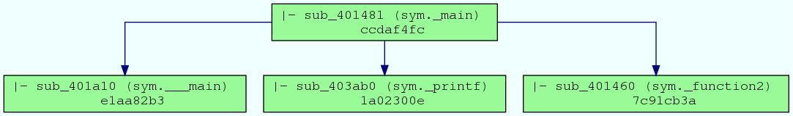
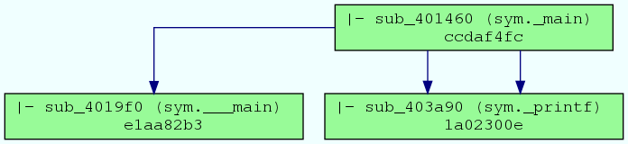
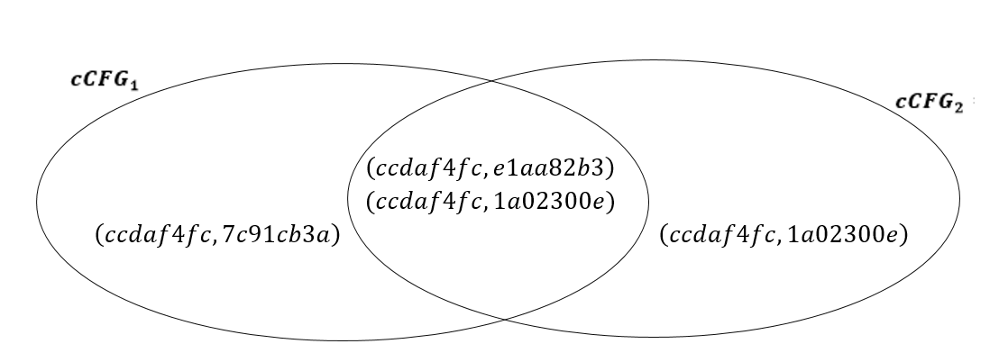
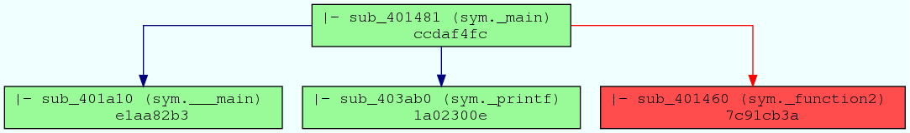
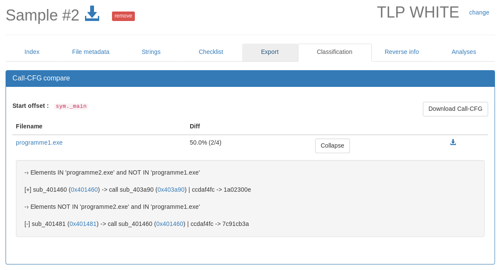
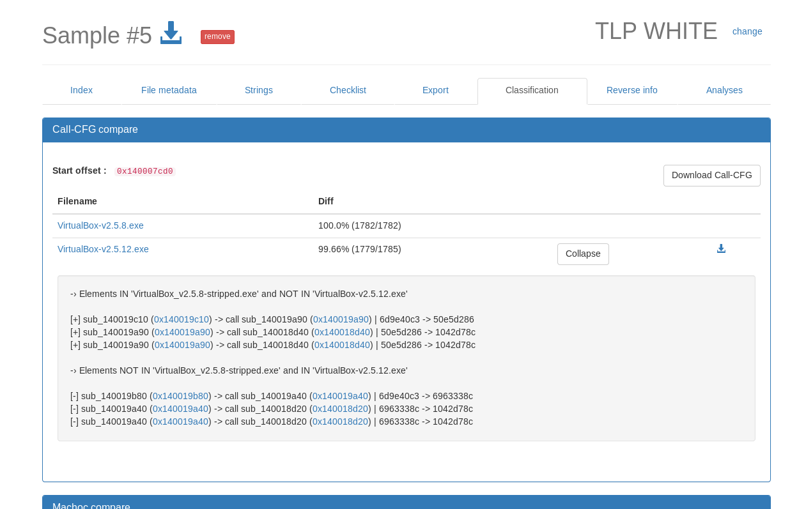

# Call CFG

Call CFG is a program's representation, based on the *Control Flow Graph* _(CFG)_ and *function call*. Two features are available : *Generation* and *Comparaison*. This documentation will explain these features. 


## Mode 1 : Generation

### Algorithm specification

1. Determine the beginning address of analysis. Otherwise, entrypoint will be used.  
2. Get all `call` instructions of function analyzed (determined by address in previous step) from disassembled code (with `metasm`)
3. For each `call` instruction : 
	* Get Machoc hash of '*caller function*'
	* Get Machoc hash of '*called function*'
	* Create t-uple `Machoc(caller function) -> Machoc(called function)`
	* Back to *step 3* recursively for each '*called function*'
4. Stored all t-uples in database
5. Generate .dot and .png files

### Example

Here is an example to illustrate the algorithm. From binary to call CFG representation. <br>
*(The source code is displayed for better understanding)*

* Source code

```
int main(){
	for (int i=0; i < 2000; i++){
    if (i > 100)
    	printf("This is a program test : %d\n",i);
    else
    	function2();
}

void function2(){
	return;
}
```


*  Call CFG representation



With this example, extracted t-uples are :

* Machoc('sym._main') -> Machoc('sym.__main')
* Machoc('sym._main') -> Machoc('sym._printf')
* Machoc('sym._main') -> Machoc('sym._function2')

That corresponds to : 

``` 
(ccdaf4fc, e1aa82b3)
(ccdaf4fc, 1a02300e)
(ccdaf4fc, 7c91cb3a)
```


## Mode 2 : Comparaison

This second feature compare two call CFG and allow us to identify quickly the precise differences.

### Algorithm specification

1. Get t-uples from database for compared files n°1 and n°2 : `tuples_ccfg_1` and `tuples_ccfg_2` <br>*(Feature 'Generation' must be used first)*
2. Jaccard index (Intersection over Union) is calculated, using t-uples
3. Set differences are calculated : `tuples_ccfg_1 \ tuples_ccfg_2` and `tuples_ccfg_2 \ tuples_ccfg_1`
4. Create new call CFG with differences in specific color (red)  

### Example

 * T-uples of analyzed file n°1 : `tuples_ccfg_1`

We can use example in *Mode 1 : Generation* :

``` 
(ccdaf4fc, e1aa82b3)
(ccdaf4fc, 1a02300e)
(ccdaf4fc, 7c91cb3a)
```

 * T-uples of analyzed file n°2 :  `tuples_ccfg_2`

We can generate t-uples from this example binary : <br>
*(The source code is displayed for better understanding)*

```
int main(){
	for (int i=0; i < 10; i++){
    if (i % 2 = 0)
    	printf("Even number : %d\n",i);
    else
    	printf("Odd number : %d\n",i);
}
```

Call CFG representation : 




``` 
(ccdaf4fc, e1aa82b3)
(ccdaf4fc, 1a02300e)
(ccdaf4fc, 1a02300e)
```
 
 * Jaccard index

With this representation, we can easily calculate Jaccard index : 



`S(cCFG1, cCFG2) = 2 / 4 = 50.0 % `

* Set differences

`cCFG2 \ cCFG2 = (ccdaf4fc, 1a02300e) `

`cCFG1 \ cCFG2 = (ccdaf4fc, 7c91cb3a) `


* New call CFG of analyzed file n°1, with differents in analyzed file n°2




## Usage : 

You can find comparaison results in tab 'Classification' in Polichombr. Except for this example, only binaries with Jaccard index >= 80 % are displayed. 



## Screenshot : 

